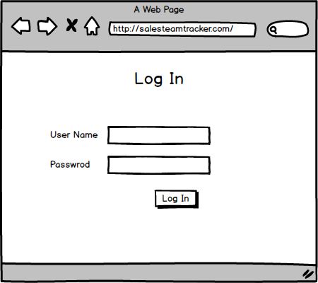
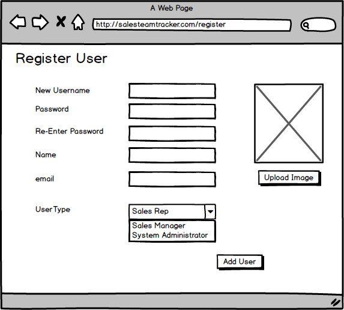
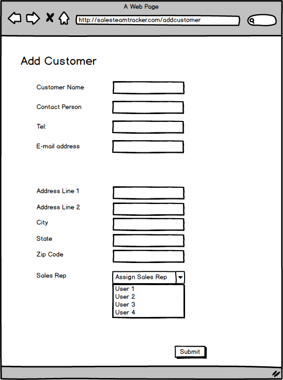
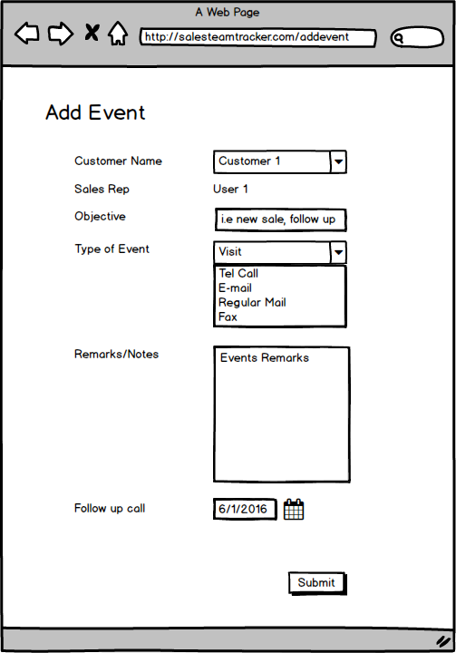
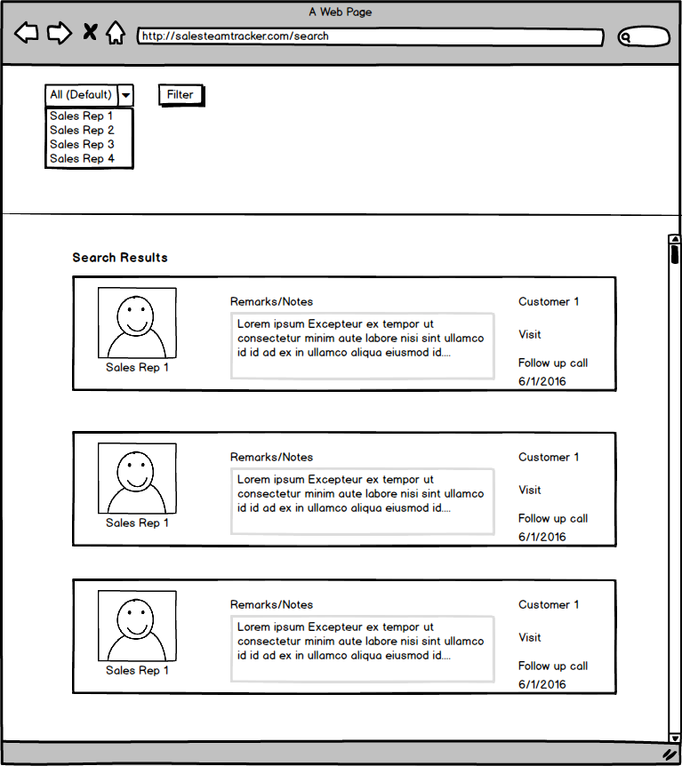
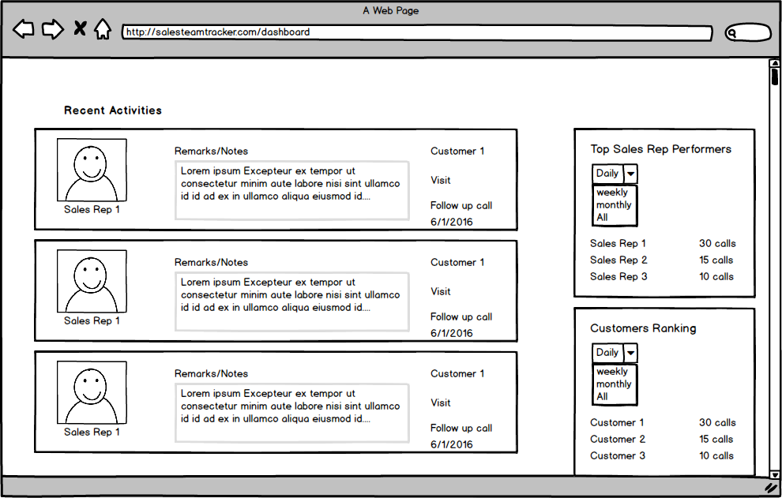
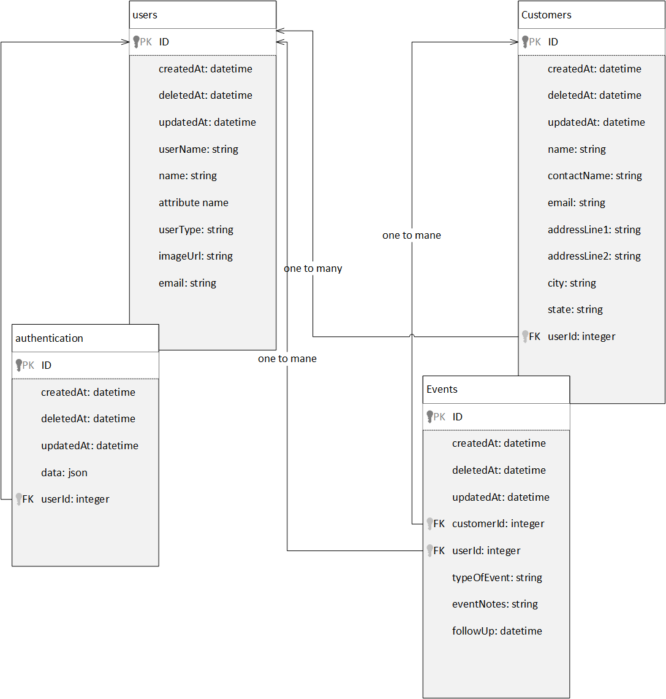

Sales Calls Tracker App
=======================

Description:
------------

During my previous career as a Sales Engineer/Sales Manager, one fo the challenges were keeping records of interactions between Sales People and Customers up to date and useful was a huge challenege for several reasons some of them: 1. CRM Systems were a bit complicated and not easy to fill consistencly 2. Searching and sorting out all the events were a bit tough for new sales reps that were taking old sales reps spots or swapping customers. 3. Sales Managers find it hard to evaluate the performance of the team based on their visits.

Based on that i came up with the idea of this simple web application that will make it simple for sales reps to log their interactions with customers and be able to sort and search, sort the interactions based on different criterias (i.e specific time frame, specific customer or specific sales rep.

User Stories
------------

[User Stories](https://trello.com/b/eXcT6ru6/sales-team-tracker-web-app)

Wireframes
----------

-  Log in

---------------------------------------------------------

- Add a User

- Add a customer

- Add Event

- Filter

- Sales Manager Dashboard

Models
------

APIs, Plugins, Libraries and Frameworks
---------------------------------------

Filestack API (<https://www.filestack.com/>) is used to upload photos to users.
